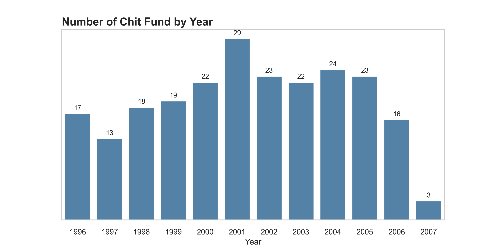

# Background And Overview
Traditional credit scoring methods focus on factors like **credit history** and **debt-to-income ratio**, but these may not accurately assess individuals without formal credit records.

**Chit Funds**, a popular form of crowdfunding in India, offer a way to evaluate creditworthiness based on **contribution history**, **bidding patterns**, and **participation**. This approach highlights key traits like **financial discipline**, **trustworthiness**, and **creditworthiness**.

This project aims to analyze financial behaviors in Chit Funds and develop a **credit scoring algorithm** tailored to individuals operating outside traditional financial systems.

The Python code used for loading data, cleaning data, performing exploratory data analysis, and data modeling can be found [here](https://github.com/nhatnhm/CLASSIFYING-CREDIT-SCORES-WITH-K-MEANS-INSIGHTS-FROM-CHIT-FUND-DATA-IN-INDIA/blob/main/Src_code_Credit_Chit_Fund.ipynb)
# Data Structure & Initial Checks
**Data Source**: The Chit Fund data is provided by **Harvard Dataverse** ([link](https://dataverse.harvard.edu/dataset.xhtml?persistentId=doi:10.7910/DVN/GWOTGE)).

The dataset consists of **Primary** and **Secondary data** collected from chit-fund companies in India for the **Credit Scoring Project**, dated **2012-12-01**.

Although the dataset contains **5 tables**, only **3 tables** were selected for analysis due to the specific requirements of the project:

-   **cf1_delhi_collateral**
-   **cf1_delhi_surety**
-   **cf1_delhi_transaction_data**

These tables collectively contain **35,920 records**.

The **detailed description** of each column in the dataset can be found [here](Data/data_collection&description.pdf)
# Theoretical base
## Overview of Chit Funds
**Chit Funds mechanism**
- **Chit funds** operate with a defined start date and a duration that typically corresponds to the number of participants. Members contribute regular installments into a common pool. Each month, a unique **reverse auction** is conducted, where participants compete for a lump sum called the **"Prize Money."** The winner is the member who agrees to forgo the largest portion of their future contributions in exchange for the immediate payout.
- The remaining pool, after deducting a small management fee, is distributed as a **dividend** among all members. This process repeats monthly, ensuring each member has an opportunity to access a larger upfront amount during the chit's duration. Essentially, chit funds provide a way to **borrow against your future savings** while also earning returns on the pooled contributions.

**Key roles in a Chit fund**
1.  **The Winning Bidder**
    -   The member who submits the **lowest reverse bid** during the auction receives the lump sum **"Prize Money."**
    -   This acts as a **short-term loan** from the pooled contributions.
2.  **The Members**    
    -   All members contribute monthly installments, including the borrower.
    -   Each member receives a portion of the remaining pot as a **dividend,** which reduces their effective contribution for the following month.
    -   Over time, this doubles as a **savings plan** with periodic returns.
3.  **The Organizer**    
    -   Responsible for managing the chit fund, including conducting auctions and distributing funds.
    -   They earn a **commission fee** (typically ~5%) for their services.
## Elbow
- The **elbow method** is a straightforward and effective tool for determining the optimal number of clusters (**K**) in K-means clustering. It involves visualizing the trade-off between the number of clusters and the improvement in explaining the data's variance.
- The method gets its name from the shape of the resulting graph. Ideally, the graph displays a **sharp bend** or **"elbow"** where the **Within-Cluster Sum of Squares (WCSS)** begins to decrease at a slower rate as more clusters are added. This point indicates that increasing the number of clusters beyond it yields **diminishing returns** in capturing the data's structure.
- In simpler terms, the elbow method helps identify the **"sweet spot"** where the number of clusters strikes a balance between too few and too many, making it a valuable tool for effective K-means analysis.

## Silhouette
**Silhouette Score Concepts**
The **silhouette score** evaluates how well a clustering algorithm (like K-Means) groups similar data points. It’s calculated for each data point based on two key distances:
1.  **(a)** The average distance to all other points within the same cluster (how tightly the point is grouped).
2.  **(b)** The average distance to points in the nearest neighboring cluster (how far the point is from other clusters).

The silhouette score (S) is computed as:  
S= (b-a) / max(a,b)

-   SSS ranges from **-1** to **1**:
    -   **Close to 1**: The point is well-clustered (low a, high b).
    -   **Close to 0**: The point is near the decision boundary between clusters.
    -   **Negative**: The point may be assigned to the wrong cluster.
    
**Python-explained Silhouette Score**
Scikit-learn provides tools to evaluate clustering performance using **silhouette scores**:

1.  **`silhouette_score`**: Calculates the **average silhouette score** for the entire dataset, indicating how well the clustering algorithm separates the data.
2.  **`silhouette_samples`**: Computes the **silhouette score for each data point**, showing how well individual points fit within their clusters.

## K-Means
**K-Means clustering** is a widely used unsupervised learning algorithm, often serving as an introduction to clustering techniques. Its goal is to group data points into clusters by minimizing the distance between points within each cluster.

The process works as follows:

-   The algorithm places **centroids** (imaginary cluster centers) in the data space.
-   Each data point is assigned to the **nearest centroid**, forming clusters.
-   The centroids are updated iteratively based on the average position of the points in their cluster.
-   This process repeats until the overall distance within clusters is minimized, achieving **optimal cluster formation**.

**Strengths of K-Means**

-   **Simple to implement:** Easy to understand and apply.
-   **High-performance:** Efficient for large datasets with numerical features.
-   **Easy to interpret:** Results are straightforward to explain.
-   **Scalable:** Handles large datasets effectively.

**Drawbacks of K-Means**

-   **Sensitive to scale:** Requires data standardization for accurate results.
-   **Limited to numerical data:** Not ideal for datasets with categorical variables.
-   **Sensitive to outliers:** Outliers can distort cluster centroids and results.

**K-Means Variations**

1.  **K-Medians:**
    -   Uses medians instead of means for centroids.
    -   **Strength:** More robust to outliers.
2.  **K-Medoids:**
    
    -   Chooses actual data points as centroids (medoids).
    -   **Strength:** Useful when centroids need to be meaningful data points.
3.  **Fuzzy C-Means:**
    
    -   Allows data points to belong to multiple clusters with varying degrees of membership.
    -   **Strength:** Suitable for datasets with overlapping clusters.
4.  **K-Means++:**
    
    -   Uses a smarter initialization method for centroids to improve convergence.
    -   **Strength:** Reduces the risk of poor clustering due to random initialization (commonly used as the default in libraries like Scikit-learn).
# Data cleaning
- Handling missing values: Depending on the data in each column, different methods are applied. Missing values can be replaced with **0**, **"NA"**, or logically imputed based on the context of the data
- Merge the three tables into a single dataframe to simplify the process of building machine learning models. Additionally, create new columns as needed to enhance the efficiency of both analysis and machine learning tasks.

# Exploratory Data Analysis
**Age distribution in the dataset**
- The dataset reveals a **broad age distribution** among chit fund participants in India, ranging from **14 to 86 years**. As shown in the chart, the **25 to 54 age group constitutes the majority**, with a **steady increase in participation** within this demographic
- This trend reflects **substantial financial needs** during these years, such as **purchasing homes, acquiring vehicles**, and addressing other major expenses. However, participation **gradually declines beyond age 54**, indicating that as individuals grow older, their **demand for loans and financial savings tends to decrease**

**Which Group Age tends to have higher chit value?**
- Based on the observed age groups, the **average chit value** was calculated for each group's participation. The results indicate that the **middle-aged group (45–74 years)** tends to participate in chit funds with **higher chit values** compared to the **younger group (14–44 years)**. This trend is reasonable, as middle-aged individuals typically have had **more time to accumulate assets**, **higher incomes** to afford larger installments, and **greater financial needs**, such as purchasing a house or car
- In contrast, the **senior age group (75–86 years)** tends to engage in chit funds with **lower chit values**. This is likely due to the **smaller number of participants** in this age group and their **reduced financial needs**

**Which age group is more likely to make early payments, and conversely?** 
- The early payment rates and late payment rates for each age group were also examined. From the two charts below, it is evident that as age increases, the **late payment rate decreases**, while the **early payment rate increases**. This trend suggests that older members are **less likely to make late payments** and **more likely to make early payments**.
- One possible explanation for this trend is that as members age, they are more likely to achieve **financial stability**, possibly due to **career success** leading to **higher and more stable incomes**. Additionally, older members may have **accumulated more financial experience** and are generally more conscientious about managing their finances responsibly.

**Number of Chit Fund by Year**
- The **number of established chit funds** demonstrated an annual increasing trend, **peaking in 2001**. Subsequently, it stabilized at **80% of the peak level**. However, by **2007**, the number of newly established chit funds had declined to **nearly 90% of the 2001 level** and dropped by **approximately 70% compared to the previous year**. This decline can be attributed to the **global economic crisis**, which caused **financial hardships**, reducing people's willingness to establish new chit funds.

# Data Modeling
## Determining the Optimal Number of Clusters
### Elbow method
This code calculates the distortion (loss) to find the optimal number of clusters 𝐾 for the K-Means algorithm.
1. Initialize the losses list to store the loss values for each 𝐾
2. Loop through the number of clusters 𝑖, ranging from 1 to 𝐾−1
3. In each iteration:
- Train a K-Means model with 𝑖 clusters:
	- init='k-means++': Uses an initialization method that speeds up convergence
	- random_state=10: Ensures reproducibility of results
- Compute the distances from each data point to all centroids, and find the minimum distance for each point.
- Sum the minimum distances to calculate the distortion (loss) and store it in losses.

>     # Initialize an empty list to store the loss values for each K
>     losses = []
>     K = 10  # Max number of clusters to test
>     
>     # Loop over the range of possible K values
>     for i in range(1, K):
>         # 1. Train the KMeans model with number of clusters = i
>         kmeans_i = KMeans(n_clusters=i, init='k-means++', random_state=10)
>         kmeans_i.fit(df_scale)
>         
>         # 2. Calculate the distortion (loss)
>         # 2.1. Calculate the distance to all centroids
>         d2centroids = cdist(df_scale, kmeans_i.cluster_centers_, 'euclidean')  # shape (n, k)
>         
>         # 2.2. Get the minimum distance to the nearest centroid
>         min_distance = np.min(d2centroids, axis=1)  # shape (n)
>         
>         # Sum the minimum distances to calculate the loss
>         loss = np.sum(min_distance)
>         
>         # Append the loss to the list
>         losses.append(loss)

- Selecting the number of clusters at the **elbow point** allows the algorithm to balance capturing the **general clustering structure** while avoiding **overfitting**. In the figure provided, the primary elbow point is observed at **k=3**, indicating that increasing the number of clusters beyond **k=3** yields only marginal improvements in the distortion function.

### Silhouette method
This code loops through the number of clusters iii from 2 to 7 and performs the following steps for each cluster count:

1.  **Create KMeans instance** with the specified number of clusters, initialized using the 'k-means++' method, set to run 10 initializations (`n_init=10`), with a maximum of 100 iterations (`max_iter=100`), and a fixed random seed (`random_state=42`).
2.  **Determine subplot position**: It calculates the subplot position using `divmod(i, 2)` to arrange subplots in a 2-column layout.
3.  **Create SilhouetteVisualizer**: The `SilhouetteVisualizer` is initialized with the KMeans model, then fitted to the scaled data (`df_scale`) to visualize the silhouette score for the current cluster count.

>     # Loop through the number of clusters from 2 to 7
>     for i in [2, 3, 4, 5, 6, 7]:
>         '''
>         Create KMeans instance with the specified number of clusters
>         '''
>         km = KMeans(n_clusters=i, init='k-means++', n_init=10, max_iter=100, random_state=42)
>         
>         # Determine the position of subplots
>         q, mod = divmod(i, 2)
>         
>         '''
>         Create SilhouetteVisualizer instance with the KMeans instance
>         Fit the visualizer to the data
>         '''
>         visualizer = SilhouetteVisualizer(km, colors='yellowbrick', ax=ax[q-1][mod])
>         visualizer.fit(df_scale)

The **Silhouette analysis** shown in the graphs above is used to determine the **optimal value for n_clusters**.

-   Values of **4, 5, 6, and 7** for n_clustersare considered **suboptimal** for the given data due to clusters with **silhouette scores below the average** and significant **variations in the sizes of the silhouette cells**.
-   Values of **2 and 3** for n_clusters​ appear to be **optimal**, as each cluster's silhouette score **exceeds the average**, and the size variations are **consistent**. Additionally, the **uniform thickness of the silhouette charts** supports decision-making. For n_clusters ​= 3, the **thickness of the silhouette cells** is more even compared to n_clusters = 2, where one cluster's thickness is noticeably larger than the other's. Therefore, the **optimal number of clusters** is selected to be **3**.

## Results Visualization
**Compare the tabular overview of the average values between the three clusters**
- After the model categorizes the data into three groups, a statistical analysis of all columns in tabular format will be performed as follows. In general, it is evident that **cluster 1** exhibits superior average financial metrics compared to **clusters 0 and 2**. For instance, the average **std_inst_paid** is notably lower in **cluster 1** than in the other two clusters, and the **prized_amt/chit_value ratio** is also higher. Regarding financial behavior, **cluster 1** demonstrates a higher average early payment rate and lower average **default rate (ratio_default)** and **3-month default rate (ratio_default_90)** compared to the other two groups

**Compare n_surety and n_collateral by cluster**
- The chart illustrates the distribution of collateral and surety. Collateral amounts are predominantly associated with members of cluster 0, while the surety amounts are relatively evenly distributed between members of cluster 1 and cluster 2.

**Compare values by cluster using box plot**
- Box plot charts are used to compare the dispersion of financial transaction indicators, grouped by cluster values. As observed in the comparison table above, members of **cluster 1** demonstrate better financial indicators, particularly in the **prized_amt/chit_value_ column**. Meanwhile, other indicators exhibit relatively minor differences across the clusters.

 
 
 **Cluster distribution between std_diff_inst and the ratio of prized_amt to chit_value**
- The scatter plot illustrates the correlation between the **prized_amt/chit_value_ and _std_diff_inst_ columns.** It is evident that the majority of members in cluster 1 are located in the bottom right, indicating a **high _prized_amt/chit_value_ and low _std_diff_inst_.** 
- Meanwhile, members of **cluster 2** primarily occupy the lower and middle left sections of the plot, reflecting a **lower _prized_amt/chit_value** and **higher _std_diff_inst** compared to **cluster 1**.Members of **cluster 0** exhibit similar characteristics to **cluster 1**, though some points show **higher _std_diff_inst_ values** and a **prized_amt/chit_value_ lower** than **cluster 1** but higher than *cluster 2.*

 
 
# Conclusion
**Conclusion of the 3 clusters based on their characteristics**:

1.  **Cluster 0: "Good" Credit Score**
    
    -   Average chit value: ~134,807
    -   Ratio of prized_amt to chit_value: ~86%
    -   Average std_diff_inst: ~1,959
    -   Ratio of late payments: ~14%
    -   Ratio of defaults: ~2.6% (90-day defaults: ~1.5%)
    
2.  **Cluster 1: "Very Good" Credit Score**  
    -   Average chit value: ~94,087
    -   Ratio of prized_amt to chit_value: ~91%
    -   Average std_diff_inst: ~1,107
    -   Ratio of late payments: ~13%
    -   Ratio of defaults: ~2.3% (90-day defaults: ~1.4%)
    
3.  **Cluster 2: "Fair" Credit Score**
    -   Average chit value: ~99,086
    -   Ratio of prized_amt to chit_value: ~74%
    -   Average std_diff_inst: ~2,599
    -   Ratio of late payments: ~22%
    -   Ratio of defaults: ~6.3% (90-day defaults: ~4.3%)
